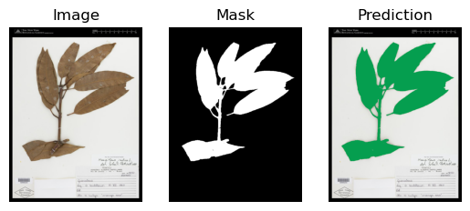
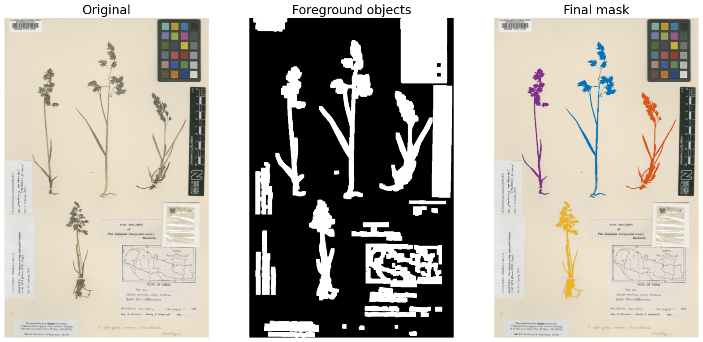

# Herbarium Segmentation

This repository contains the code and links to the dataset and retrained models from the following publication: **[Evaluating Segmentation Approaches on
Digitized Herbarium Specimens](https://link.springer.com/chapter/10.1007/978-3-031-47966-3_6)**

## Dataset 
See: [Dataset](Dataset.md)

## Pretrained models

#### Binary Segmentation

Inference and Training Code: [plant_binary_segmentation](notebooks/plant_binary_segmentation.ipynb)

<p>

</p>

| **Model** | **IoU** | **F1** | **Download** |
|:------------------:|:----------------:|:---------------:|:---------------:|
| UNet++             | **0.951**            | **0.975**           | [UNet++](https://cloud.ilabt.imec.be/index.php/s/RJwpz3qLGGo3X5N/download/unetplus_efficientnet-b0_best-epoch=189.ckpt) |
| U-Net              | 0.950            | 0.974           | [U-Net](https://cloud.ilabt.imec.be/index.php/s/Sr2aZPzBqskbcky/download/unet_efficientnet-b0_best-epoch=196.ckpt) |
| DeeplabV3+         | 0.915            | 0.954           | [DeeplabV3+](https://cloud.ilabt.imec.be/index.php/s/64J3k6mAs672LGM/download/deeplab_efficientnet-b0_best-epoch=199.ckpt) |


#### Instance Segmentation

YOLOv8 inference and training code:  [plant_instance_YOLOv8](notebooks/plant_instance_YOLOv8.ipynb)

Mask2Former inference code:  [mask2former_segmentation](notebooks/mask2former_segmentation.ipynb) (training code TODO)

<p>

</p>

*Left to right: Detectron2, Mask R-CNN, YOLOv8, and Mask2Former*

| **Model**   | **Box AP** | **Box AP50** | **Mask AP** | **Mask AP50** | **Plant AP** | **Object AP** | **Download** |
|:-----------:|:----------:|:------------:|:-----------:|:-------------:|:------------:|:-------------:|:------------:|
| Detectron2  | 76.7       | 95.7         | 68.4        | 85.4          | 9.0          | 78.3          | [Detectron2](https://cloud.ilabt.imec.be/index.php/s/j3WFAP9YCopiaZj/download/detectron2-ins-R50-FPN.pth)         |
| Mask R-CNN  | 78.2       | 94.6         | 76.7        | 92.7          | 31.9         | **84.1**          | [Mask R-CNN](https://cloud.ilabt.imec.be/index.php/s/PaqpLFTQH2kdnko/download/maskrcnn-best-epoch=199.ckpt)         |
| YOLOv8      | **87.0**       | **98.5**         | 78.5        | **96.1**          | 48.1         | 83.5          | [YOLOv8l-seg](https://cloud.ilabt.imec.be/index.php/s/B9s7wCpgyenRoyy/download/yolo_instance_best.pt)         |
| Mask2Former | 80.7       | 93.2         | **78.9**        | 91.0          | **77.0**         | 79.2          | [Mask2Former](https://cloud.ilabt.imec.be/index.php/s/3N59LiykEYXJn9t/download/mask2former-ins-best-epoch=195.ckpt)         |

#### Panoptic Segmentation

Mask2Former inference code:  [mask2former_segmentation](notebooks/mask2former_segmentation.ipynb) (training code TODO)

| **Model**       | **Mask AP\*** | **Mask AP50\*** | **Plant IoU** | **Download** |
|:---------------:|:-----------:|:-------------:|:-------------:|:------------:|
| YOLOv8 + UNet++ | **83.7**        | **98.3**          | **0.951**         | [UNet++](https://cloud.ilabt.imec.be/index.php/s/RJwpz3qLGGo3X5N/download/unetplus_efficientnet-b0_best-epoch=189.ckpt) - [YOLOv8l-seg](https://cloud.ilabt.imec.be/index.php/s/6tRFZWejTofk9SN/download/yolo_objects_best.pt) (objects only)       |
| Mask2Former     | 81.6        | 95.7          | 0.899         | [Mask2Former](https://cloud.ilabt.imec.be/index.php/s/3oiAJ5A52ZZDyiG/download/mask2former-pan-best-epoch=196.ckpt)         |

\**Mask APs for object classes only*
## Labeling new data

Semi-automatic labeling: [generate_plant_masks](notebooks/generate_plant_masks.ipynb)

Interactive Manual validation with OpenCV via: [label_plant_masks.py](label_plant_masks.py)

<p>

</p>

### Preparing custom dataset
1. Manually label objects with LabelMe or similar tool.
2. Convert to COCO format
3. Generate panoptic labels

### Citation

If you use this dataset or code in your research, please use the following BibTeX entry:

```bibtex
@inproceedings{milleville2023evaluating,
  title={Evaluating Segmentation Approaches on Digitized Herbarium Specimens},
  author={Milleville, Kenzo and Chandrasekar, Krishna Kumar Thirukokaranam and Van de Weghe, Nico and Verstockt, Steven},
  booktitle="Advances in Visual Computing",
  year="2023",
  publisher="Springer Nature Switzerland",
  address="Cham",
  pages="65--78",
  isbn="978-3-031-47966-3"
}

```

